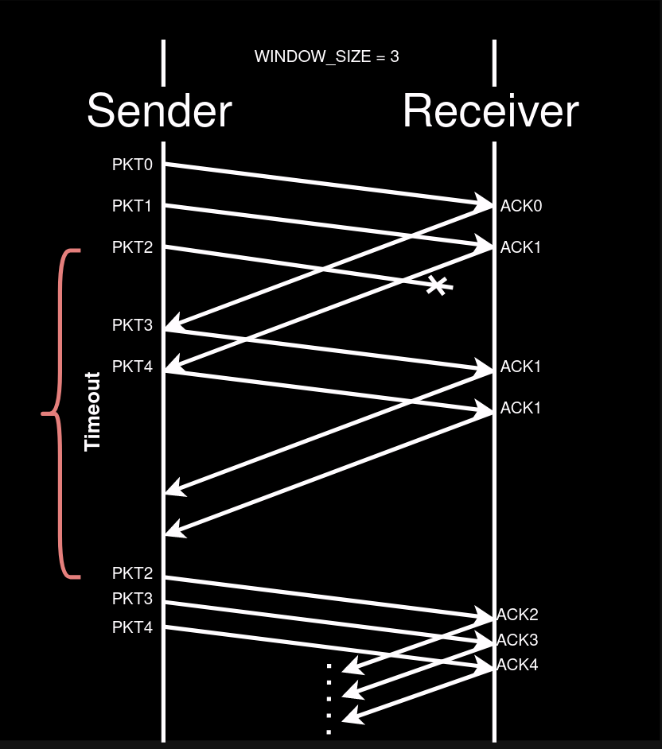

# Go-Back-N ARQ - Java Implementation

**Go-Back-N** is a sliding window and pipelined networking protocol that allows the sender to send multiple packets without waiting for the receiver's acknowledgements.

This implementation makes use of multi-threading to control the pipelined behavior.



## Receiver

In GBN, we have a simple **receiver** that only checks if arriving packets are in the correct order; if not, they are dropped. The acknowledgements are always sent relative to the last correctly received packet.

```
nextSeqNum = 0;

while true:
  if a packet is received:
    if sequenceNumber == nextSeqNum:
      deliver data to upper layer;
      sendACK(nextSeqNum);
      nextSeqNum++;
    else:
      sendACK(nextSeqNum - 1);
```

## Sender

The **sender** has a send buffer (sent but not yet ACK'ed) and two pointers, `sendBase` and `nextSeqNum`, to keep control of the sliding window.

```
nextSeqNum = 0;
sendBase = 0;

while true:
  if nextSeqNum < sendBase + WINDOW_SIZE:
    sendPck(nextSeqNum);
    nextSeqNum++;

  if receiveACK(n):
    sendBase = n + 1;
    if sendBase == nextSeqNum:
      stopTimer();
    else:
      startTimer();

  if timeout:
    startTimer():
    for i = sendBase to nextSeqNum-1:
      sendPck(i);

```

There are two **threads** for the sender, "send" and "ack". The first takes care of reading the file and sending packets, while the latter handles receiving ACKs.

Every timeout, a TimerTask is triggered to resend all packets in the send buffer.


## Usage

1. Compile the Java files:
   ```sh
   javac -d ./target src/main/java/com/protocol/*.java
   ```
2. Start the Receiver:
   ```sh
   java -cp ./target com.protocol.Receiver <dest_IP>
   ```
3. Start the Sender:
   ```sh
   java -cp ./target com.protocol.Sender <dest_IP> <window_size> <timeout>
   ```

- `dest_IP`: destination machine IP address
- `window_size`: Number of packets the sender will send without receiving an ACK
- `timeout`: time in milliseconds the sender will wait until retransmission

### Docker

To simulate a transmission between two different machines, you can create two containers: one for the sender and the other for the receiver. There is a Docker Compose file to assist with this task.

The `docker compose up` command will create a default network and two containers with both sender and receiver classes. You can run `docker exec -ti <container_id> bash` to execute commands inside the containers.

> Tip: Run `docker network ls` and `docker network inspect <network_id>` to get the containers' IP addresses.
